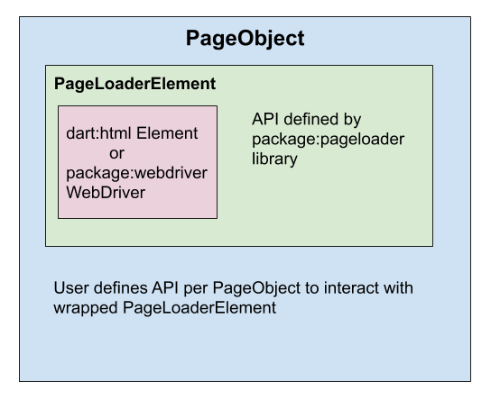

PageLoader Anatomy
=====================

This section will not go over how to build and use a PageObject.
For a beginner's guide, refer to our [quick guide](quick_guide.md).
This page will assume that the reader has gone through the quick guide.

PageLoader is based on the [PageObject Design Pattern](https://martinfowler.com/bliki/PageObject.html)
and is built using Dart codegen. Users write the abstract `PageObject` class and code generation implements this abstract `PageObject`.

For example:

    1. User writes `my_po.dart`.
    2. PageLoader code generation generates `my_po.g.dart`.

Inside a PageObject?
----------------------

Your PageObject will have two layers of wrapping:

1. Your PageObject wraps a [`PageLoaderElement`] object.
2. [`PageLoaderElement`] wraps an element from [`dart:html`] or [`package:webdriver`].



The user is responsible for writing their own `PageObject` and its
internal methods. In most cases, these user-defined methods will interact with the rich [`PageLoaderElement API`].

By itself, `PageObjects` have no specific implementation until it is constructed with either a [`dart:html`] Element or [`package:webdriver`] WebDriver. 
This allows for users to write a single `PageObject` and use this in both HTML and Webdriver implementations.

Most of the methods within [`PageLoaderElement`] behavior similarly in 
both `dart:html` and `package:webdriver` implementations, but there are some cases where they may differ in usage and behavior. Refer to the [`PageLoaderElement API`] for more information.

PageObject Construction and Code Generation
-----------------------------

For every `PageObject` code written, there is an equivalent generated code.

PageLoader uses the following dependencies to achieve code generation:

1. [`package:build`](https://pub.dev/packages/build)
2. [`package:source_gen`](https://pub.dev/packages/source_gen)
3. [`package:built_value`](https://pub.dev/packages/built_value)

For example, if a user writes `my_po.dart`, code generation step will
generate `my_po.g.dart`.

Consider the following sample `PageObject`:

```dart
// FILE: my_po.dart
import 'package:pageloader/pageloader.dart';

part 'my_po.g.dart';

@PageObject()
@CheckTag('my-special-tag')
abstract class MyPO {
    MyPO();
    factory MyPO.create(PageLoaderElement context) =
            $MyPO.create;

    @ByCss('red-text-box')
    PageLoaderElement get _redTextBox;

    @ByTagName('blue-button')
    PageLoaderElement get _blueButton;

    bool get blueButtonIsDisplayed => _blueButton

    Future<void> clickBlueButton => _blueButton.click();

    Future<void> clickAndTypeIntoRedBox(String text) async {
      await _redTextBox.click();
      await _redTextBox.type(text);
    }
}
```

Let's break this down step-by-step to understand what is going on:

**1. Part Clause**

```dart
part 'my_po.g.dart';
// ...
```

Adding this part clause is necessary since `my_po.g.dart` essentially
becomes an extension of `my_po.dart`. This allows users to only import
`my_po.dart` and get full access to the generated code rather than
having to import both files.

**2. `@PageObject()` and `abstract class`**

When a user writes their own `PageObject`, they are creating an
[`abstract class`](https://dart.dev/guides/language/language-tour#abstract-classes) and the code generation step
implements this.

`@PageObject()` is used as the starting point for code generation step.
`package:build` will identify all abstract classes annotated with this and
generate the implemented, non-abstract version of this class.

**3. `@CheckTag('my-special-tag')`**

Adding a `@CheckTag(<tag-name>)` is optional, but 
considered best practice. `@CheckTag(...)` provides a runtime
check on whether the accessed element truly represents the
user's intended HTML Element tag.

From the above example `PageObject`, suppose:

```dart
final myPo = MyPO.create(...);
await myPo.clickBlueButton();
```

The order of operations on `myPo.clickBlueButton()` is:

1. Get the root [`PageLoaderElement`] within `MyPo`. This is not guaranteed to represent `'my-special-tag'` based on what was passed in `MyPO.create(...)`.
2. Verify that this root element represents `'my-special-tag'`.
3. Execute `clickBlueButton()` using this element.

`@CheckTag(...)` annotation is responsible for step 2; without this,
even if some other tag was passed, the test would not complain.
However, you may end up with hard to debug issues.

Let's consider a more realistic example as to why using 
`@CheckTag(...)` is a good idea. Suppose you have another `PageObject`
that wraps `MyPO`:

```dart
// FILE: 'some_other_po.dart'
import 'package:pageloader/pageloader.dart';

import 'my_po.dart';

@CheckTag('some-other-tag')
@PageObject()
abstract class OtherPO {
    OtherPO();
    factory OtherPO.create(PageLoaderElement context) =
            $OtherPO.create;

    @ByClass('foo-class')
    MyPO get myPO;
}
```

In this example, we have wrapped `MyPO` within another `PageObject`.
Note the finder `@ByClass('some-class')` used to access `MyPO` `PageObject`: we are trying to get `MyPO` by class, not tag name.

If we have the following html:

```html
<some-other-tag>
    <incorrect-tag class="foo-class">
    </incorrect-tag>
</some-other-tag>
```

then we are getting the incorrect tag since we expected
`'my-special-tag'` but instead got `'incorrect-tag'`. In this case,
`@CheckTag('my-special-class')` will complain whenever `myPO` is used
since it is being bound to the incorrect tag.

**4. Constructors**

Every `PageObject` must have the following boilerplate constructors:

```dart
MyPO();
factory MyPO.create(PageLoaderElement context) =
    $MyPO.create;
```

Note here that `factory MyPO.create(...) = $MyPO.create;` is a
[factory constructor](https://dart.dev/guides/language/language-tour#constructors) that delegates the construction of `MyPO`
to its generated counterpart `$MyPO` (from `my_po.g.dart`).

**5. PageLoader abstract getter method annotations**

In the example:

```dart
    @ByCss('red-text-box')
    PageLoaderElement get _redTextBox;

    @ByTagName('blue-button')
    PageLoaderElement get _blueButton;
```

These are abstract getter methods that PageLoader hooks into during 
code generation.

Annotations used on these abstract getter methods come in two flavors:

1. Finders (required, unique)
2. Filters (optional, multiple)

Any abstract getter method requires exactly one Finder annotation
in order for PageLoader to do its magic. In addition, each
abstract getter method with a Finder annotation can have zero or more
Filters. (However, typically you only need at most one.)

Available Finders are:

1. [`@ByClass(...)`](https://pub.dev/documentation/pageloader/latest/webdriver/ByClass-class.html)
2. [`@ByCss(...)`](https://pub.dev/documentation/pageloader/latest/webdriver/ByCss-class.html)
3. [`@ByDebugId(...)`](https://pub.dev/documentation/pageloader/latest/webdriver/ByDebugId-class.html)
4. [`@ById(...)`](https://pub.dev/documentation/pageloader/latest/webdriver/ById-class.html)
5. [`@ByTagName(...)`](https://pub.dev/documentation/pageloader/latest/webdriver/ByTagName-class.html)
6. [`@ByTestId(...)`](https://pub.dev/documentation/pageloader/latest/webdriver/ByTestId-class.html)
7. [`@ByCheckTag()`](https://pub.dev/documentation/pageloader/latest/webdriver/ByCheckTag-class.html)

There is also another annotation that can be used in place of a
Finder annotation - the [`@root`](https://pub.dev/documentation/pageloader/latest/webdriver/root-constant.html) annotation.

The `@root` annotation provides the `PageObject` direct access to its
currently bound `PageLoaderElement`. For example:

```dart
@PageObject()
@CheckTag('root-tag')
abstract class MyPO {
  // ...constructors...

  @root
  PageLoaderElement get _rootElement;

  @ByTagName('child-tag')
  PageLoaderElement get childElement;
}
```

If `MyPO` is used to bind to `root-tag` in the following:

```html
<root-tag>
    <child-tag></child-tag>
</root-tag>
```

Then `_rootElement` is bound to the `PageLoaderElement` representing
`<root-tag>` and `childElement` is bound to the `PageLoaderElement`
representing `<child-tag>`.`


There are also two context finders that wrap around the 7 Finders (non-`@root`) above:

1. [`@First(...)`](https://pub.dev/documentation/pageloader/latest/webdriver/First-class.html)
2. [`@Global(...)`](https://pub.dev/documentation/pageloader/latest/webdriver/Global-class.html)

Example of context Finders:

```dart
@First(@ByTagName('foo-tag'))
PageLoaderElement get firstFooTag;

@Global(@ByTagName('foo-tag'))
PageLoaderElement get globalFooTag;
```

Filters are useful if you want to filter the results obtained from
the Finder annotation.

For example:

```html
<div>
    <my-item class="foo"></my-item>
    <my-item class="bar"></my-item>
    <my-item class="foo"></my-item>
    <my-item class="bar"></my-item>
</div>
```

Then:

```dart
@ByTagName('my-item')
@WithClass('foo')
List<MyItemPO> get fooItems;

@ByTagName('my-item')
@WithClass('bar')
List<MyItemPO> get barItems;
```

`@WithClass(...)` filters both of these getters such that
they only return `PageObjects` with the filtered class.

Full list of Filters:

1. [`@IsDisplayed()`](https://pub.dev/documentation/pageloader/latest/webdriver/IsDisplayed-class.html)
2. [`@IsTag(...)`](https://pub.dev/documentation/pageloader/latest/webdriver/IsTag-class.html)
3. [`@WithAttribute(...)`](https://pub.dev/documentation/pageloader/latest/webdriver/WithAttribute-class.html)
4. [`@WithClass(...)`](https://pub.dev/documentation/pageloader/latest/webdriver/WithClass-class.html)
5. [`@WithInnerText(...)`](https://pub.dev/documentation/pageloader/latest/webdriver/WithInnerText-class.html)
6. [`@WithProperty(...)`](https://pub.dev/documentation/pageloader/latest/webdriver/WithProperty-class.html)
7. [`@WithVisibleText(...)`](https://pub.dev/documentation/pageloader/latest/webdriver/WithVisibleText-class.html)

Finally, these annotations may only be used on abstract getter methods that return instances of type:

1. [`PageLoaderElement`]
2. `PageObject` (class with `@PageObject()` annotation)
3. `List<T>` where T is the above 2.

**6. Lazy loading, existence, and the `NullPageLoaderElement`**

Whenever any PageLoader entity (`PageObject` or `PageLoaderElement`) is
accessed, PageLoader will lazily access these elements.

For example:

```html
<div>
    <may-exist></may-exist>
</div>
```

PageObject:

```dart
@PageObject()
abstract class MyPO {
    // ...constructors...

    @ByTagName('may-exist')
    PageLoaderElement get _mayExist;

    bool get mayExist => _mayExist.exists;

    String get mayExistInnerText => _mayExist.innerText;
}
```

Let's suppose that the `<may-exist>` tag may or may not be currently
rendered in the HTML document. Certain behaviors (ex: clicking a button)
may remove this tag or add it back in. PageLoader is not able to
ascertain its existence until this element is accessed. Also, PageLoader
does not attempt to cache knowledge about its existence.

As a result, [best practices](best_practices.md) recommends users to
manually check every element (if it may not exist) before utilizing it to avoid runtime
exceptions from being thrown:

```dart
    String get mayExistInnerText => 
        mayExist ? _mayExist.innerText : '';
```

There may be cases where you may want to return a `null` value. However,
instead of returning `null`, users should return an instance of
a `NullPageLoaderElement` via `@nullElement` annotation.

For example:

```dart {.bad}
@PageObject()
abstract class MyShoppingListPO {
  // ...constructors...

  @ByTagName('shopping-list-item')
  List<ShoppingListItemPO> get _listItems;

  ShoppingListItemPO shoppingItemWithName(String itemName) =>
        _listItems.firstWhere(
            (item) => item.attributes.contains(itemName),
            orElse: () => null);
}
```

The above is **not** recommended since it returns a `null` value when
the method signature expects a `ShoppingListItemPO`.

This means the user must do a null check in their test while also
doing an existence check:

```dart {.bad}
final shoppingList = MyShoppingListPO.create(...);
// Do stuff
final handbag = shoppingList.shoppingItemWithName('handbag');
if (handbag != null && handbag.exists) {
    // Do something with `handbag`
}
```

Instead, the user should return a `NullPageLoaderElement`-wrapped
`ShoppingListItemPO` using `@nullElement` annotation:

```dart {.bad}
@PageObject()
abstract class MyShoppingListPO {
  // ...constructors...

  @ByTagName('shopping-list-item')
  List<ShoppingListItemPO> get _listItems;

  @nullElement
  ShoppingListItemPO get _nullShoppingListItem;

  ShoppingListItemPO shoppingItemWithName(String itemName) =>
        _listItems.firstWhere(
            (item) => item.attributes.contains(itemName),
            orElse: () => _nullShoppingListItem);
}
```

Then, you can simplify the conditional checks to:

```dart {.good}
final shoppingList = MyShoppingListPO.create(...);
// Do stuff
final handbag = shoppingList.shoppingItemWithName('handbag');
if (handbag.exists) {
    // Do something with `handbag`
}
```

**7. Mixins**

By design, PageLoader follows "composition over inheritance" structure.
Direct inheritance is not possible with PageLoader since every
`PageObject` has a generated class that extends on its abstract class.

For example: `class $MyPO extends MyPO {...}` with `$MyPO` being the
generated version of `MyPO` (user-written).

However, we can use [Dart mixins](https://dart.dev/guides/language/language-tour#adding-features-to-a-class-mixins) to provide shared functionality
between `PageObjects`.

Example:

```dart
@PageObject()
mixin SharedPOMixin {
  // Note: Do NOT add constructors

  @ByTagName('foobar')
  PageLoaderElement get foobarElement;

  Future<void> clickFoobar() => foobarElement.click();
}
```

Then:

```dart
@PageObject()
abstract class ConcretePO with SharedPOMixin {
  ConcretePO();
  factory ConcretePO.create(PageLoaderElement context) =
        $ConcretePO.create;

  Future<void> clickFoobarAndReturnText() {
      await clickFoobar();
      return foobarElement.innerText;
  }  
}
```

You can also achieve even more advanced mixin combinations:

```dart
@PageObject()
mixin EmployeePOMixin {...}

// `TeacherPOMixin` cannot be mixed in unless `EmployeePOMixin`
// is also mixed in, otherwise compilation error.
@PageObject()
mixin TeacherPOMixin on EmployeePOMixin { ... }

@PageObject()
abstract class TenuredTeacherPO
    with EmployeePOMixin, TeacherPOMixin {
    // constructors and methods
}
```

[`PageLoaderElement`]: https://github.com/google/pageloader/blob/master/lib/src/api/page_loader_element_interface.dart

[`dart:html`]: https://api.dart.dev/stable/2.7.1/dart-html/dart-html-library.html

[`package:webdriver`]: https://github.com/google/webdriver.dart 

[`PageLoaderElement API`]: https://pub.dev/documentation/pageloader/latest/webdriver/PageLoaderElement-class.html